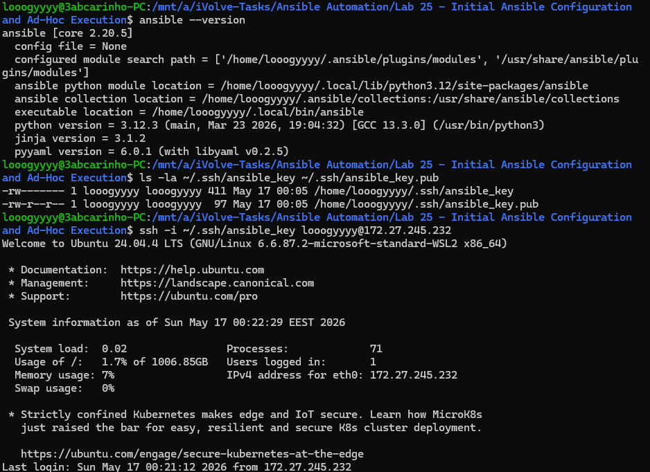
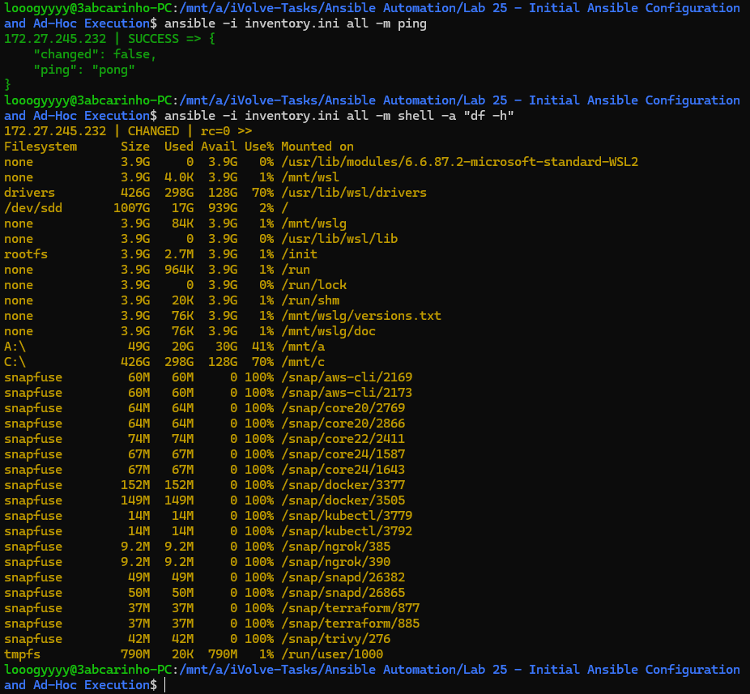

# Lab 25 — Initial Ansible Configuration and Ad-Hoc Execution

## Overview

This lab covers the foundational setup of Ansible Automation Platform on a control node, establishing secure SSH-based communication with a managed node, defining an inventory, and executing ad-hoc commands to interact with remote hosts — all without writing a single playbook.


## What Was Done

Ansible core was installed on the control node using the official PPA. A dedicated ED25519 SSH key pair was generated at `~/.ssh/ansible_key` with permissions set to `600` for the private key and `644` for the public key. The public key was transferred to the managed node using `ssh-copy-id`, enabling passwordless SSH authentication. An inventory file was created listing the managed node with its connection parameters, and Ansible's connectivity was verified using the `ping` module. Finally, an ad-hoc command using the `shell` module ran `df -h` on the managed node to report live disk space usage across all mounted filesystems.

## Inventory Configuration

```ini
[managed]
172.27.245.232 ansible_user=looogyyyy ansible_ssh_private_key_file=~/.ssh/ansible_key

[all:vars]
ansible_python_interpreter=/usr/bin/python3
```

## Key Concepts

**Control node vs managed node** — Ansible is installed only on the control node. Managed nodes require only Python and an SSH server.

**SSH key-based auth** — Ansible relies on passwordless SSH. The private key file permissions must be `600`; looser permissions cause SSH to reject the key entirely.

**Ad-hoc commands** — One-off tasks executed directly from the CLI using `-m` (module) and `-a` (arguments) without a playbook. The `shell` module supports pipes and redirections; the `command` module is safer for simple commands.

### Ansible version, SSH key permissions, and passwordless login



### Verification — Ansible ping success and ad-hoc disk space output

