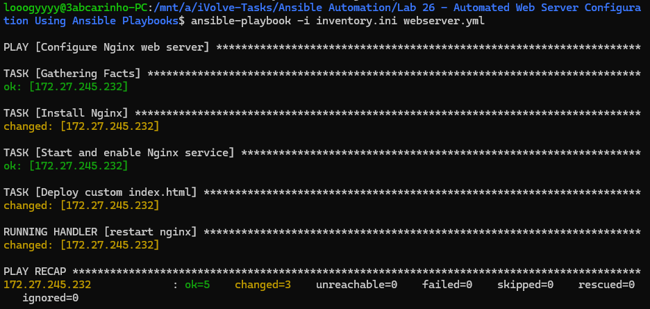
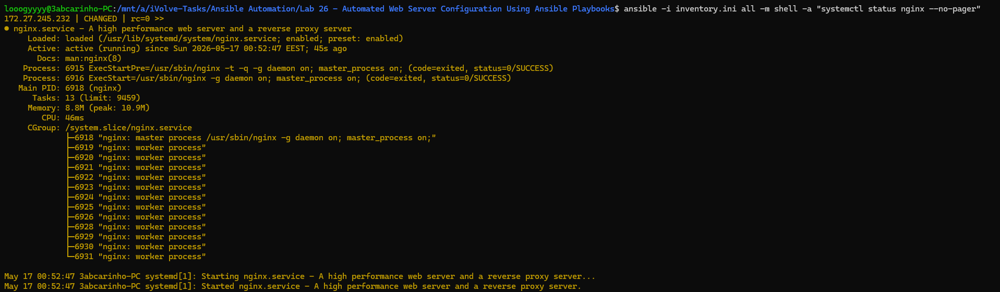
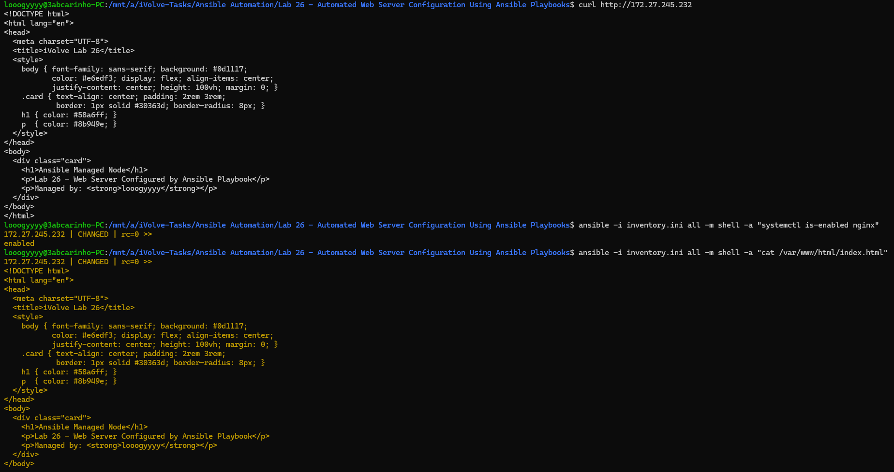

# Lab 26 — Automated Web Server Configuration Using Ansible Playbooks

## Overview

This lab demonstrates how to automate the full configuration of a web server using an Ansible playbook. Rather than running commands manually on the managed node, a single playbook installs Nginx, starts and enables the service, and deploys a custom HTML page — all from the control node. The handler pattern ensures Nginx is only restarted when the content actually changes, making the playbook fully idempotent.

## What Was Done

A playbook named `webserver.yml` was written with three tasks targeting the managed node group. The first task installs the Nginx package using the `apt` module. The second starts the Nginx service and enables it to persist across reboots. The third uses the `copy` module to push a custom `index.html` to `/var/www/html/`, replacing the Nginx default page. A handler tied to the copy task restarts Nginx only when the file changes. Passwordless sudo was configured on the managed node so the playbook could run fully unattended using `become: true`. After the first run the playbook was verified to be idempotent by confirming `changed=0` on a second execution.

## Key Concepts

**Idempotency** — running the playbook multiple times produces the same result without making unnecessary changes. On a second run all tasks show `ok` and the handler does not fire.

**Handlers** — the `restart nginx` handler is only triggered when the `copy` task reports a change, avoiding unnecessary service restarts on repeated runs.

**become: true** — grants Ansible root privileges on the managed node via sudo, required for package installation and writing to `/var/www/html/`.

**update_cache: false** — skipped because the apt cache on the managed node was already current. Enabling it caused failures due to an unresolvable third-party Helm repository in the sources list.

### Playbook execution — first run showing all tasks and handler firing

### Nginx service active and running on the managed node

### Custom page served over HTTP and confirmed on disk

