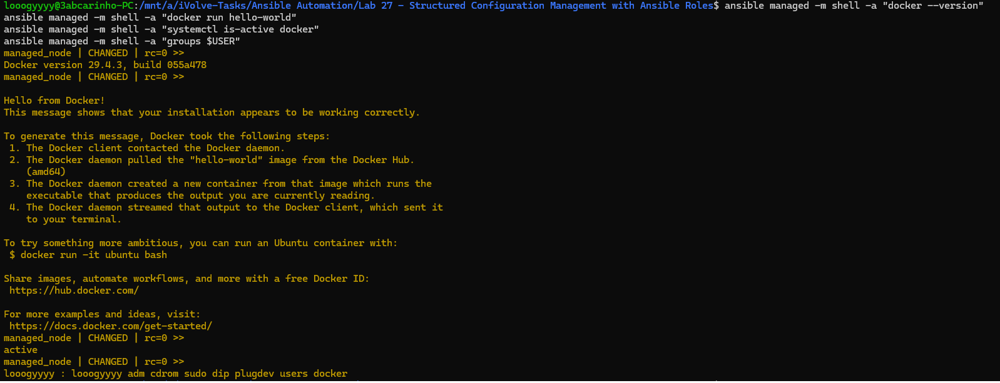
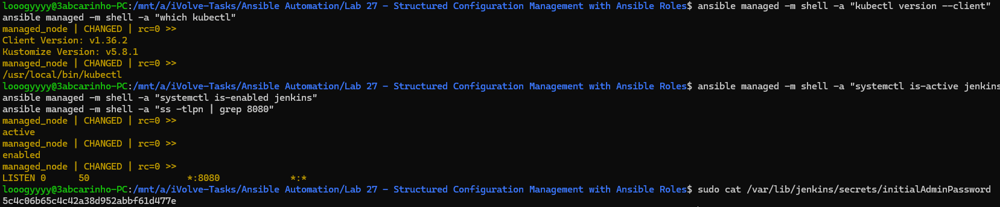
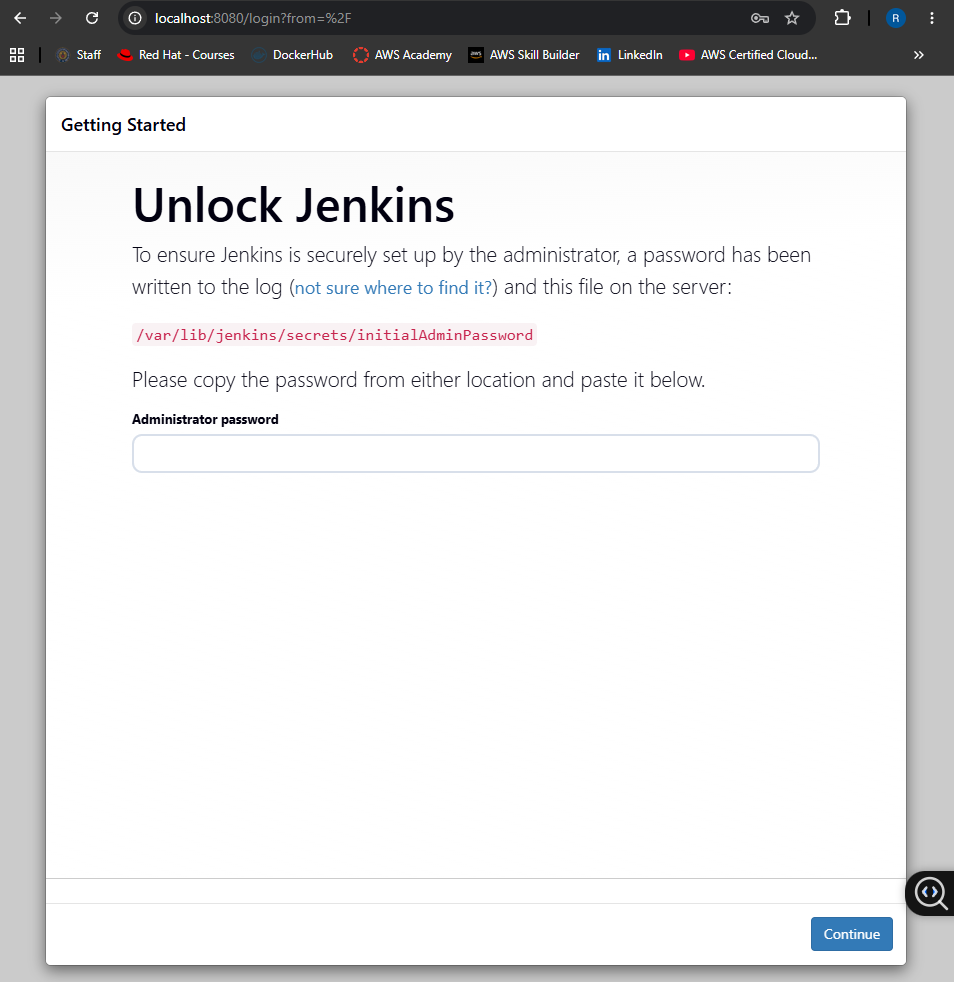

# Lab 27: Structured Configuration Management with Ansible Roles

## Overview
This lab demonstrates how to use Ansible roles to organize and structure configuration management tasks. Instead of writing everything in a single playbook, each tool is encapsulated in its own role with a standardized directory structure, making the automation reusable, readable, and easy to maintain. A single playbook then orchestrates all three roles against the managed node.

## What Was Done
Three Ansible roles were created — `docker`, `kubectl`, and `jenkins` — each responsible for installing and configuring one tool on the managed node. A main playbook was written to apply all three roles in sequence. The `docker` role installs Docker, starts and enables the service, and adds the user to the `docker` group so containers can be run without `sudo`. The `kubectl` role installs the Kubernetes CLI and places it at `/usr/local/bin/kubectl`. The `jenkins` role installs Jenkins, enables it to start on boot, and ensures it is listening on port 8080. Passwordless sudo was configured on the managed node so all roles could run fully unattended using `become: true`.

## Key Concepts
**Ansible Roles** — a standardized directory structure (`tasks`, `handlers`, `defaults`, `files`, `templates`) that separates concerns and makes each role independently reusable across different playbooks and projects.

**Single Playbook, Multiple Roles** — rather than one long playbook with all tasks mixed together, each tool's logic lives in its own role and is called from the main playbook in a clean, readable way.

**become: true** — grants Ansible root privileges on the managed node via sudo, required for package installation and service management across all three roles.

**Idempotency** — all three roles can be re-run safely without causing unintended changes; installing a package that already exists or enabling a service that is already enabled produces no change.

### Docker Verification

### kubectl & Jenkins Verification

### Jenkins Unlock Page
