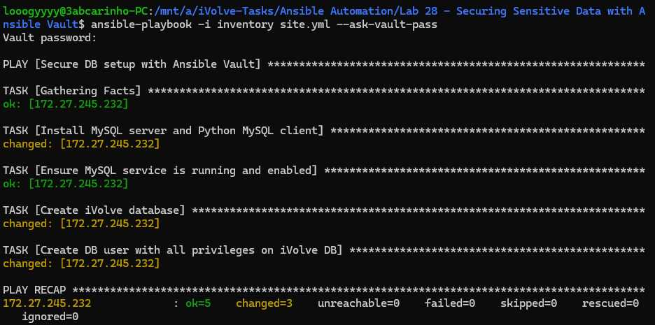
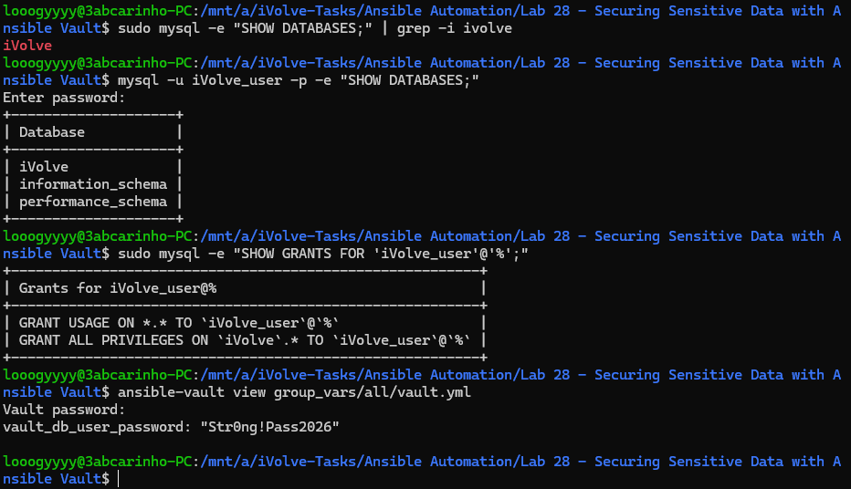
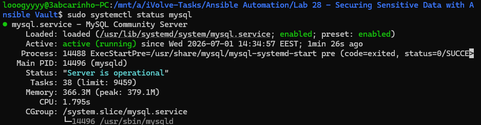

# Lab 28: Securing Sensitive Data with Ansible Vault

## Overview
This lab demonstrates how to use Ansible Vault to protect sensitive data within a playbook. Rather than storing database credentials in plain text, the password is encrypted using Ansible Vault and decrypted only at runtime when the playbook is executed. The playbook automates a full MySQL database setup — installation, database creation, and user provisioning — without ever exposing sensitive values in the codebase.

## What Was Done
A playbook named `site.yml` was written to automate MySQL setup on the managed node. It installs MySQL server and the Python MySQL client library, ensures the MySQL service is running and enabled, creates the `iVolve` database, and creates a dedicated database user with full privileges on that database. The database user's password was stored in an encrypted `vault.yml` file inside `group_vars/all/` using `ansible-vault encrypt`. The playbook is executed with the `--ask-vault-pass` flag, prompting for the vault password at runtime so the encrypted file can be decrypted on the fly without ever being stored in plain text.

## Key Concepts
**Ansible Vault** — encrypts sensitive files so credentials and secrets can be safely stored in version control without exposing their values. Only someone with the vault password can decrypt and view the contents.

**group_vars** — variables defined in `group_vars/all/vault.yml` are automatically applied to all hosts in the inventory, keeping the playbook clean and free of hardcoded values.

**--ask-vault-pass** — prompts for the vault password at playbook execution time, allowing Ansible to decrypt the vault file and inject the variables into the playbook without storing the password anywhere.

**Idempotency** — the playbook can be re-run safely. Tasks like ensuring the service is running or that the database exists will report `ok` rather than `changed` on subsequent runs.

### Playbook Execution

### Database & User Verification

### MySQL Service Running
