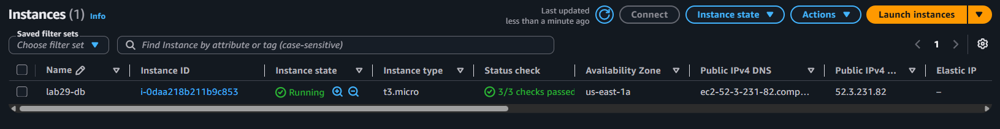
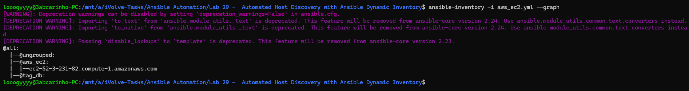
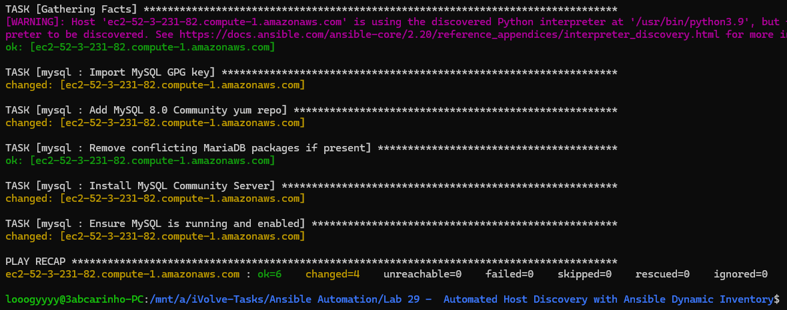
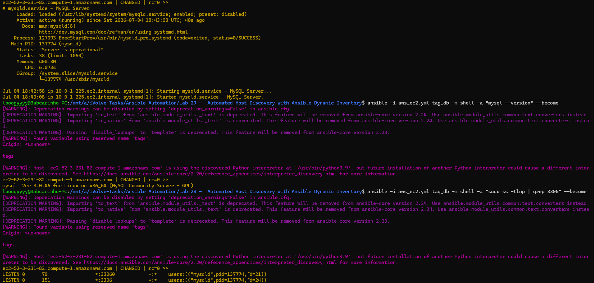

# Lab 29: Automated Host Discovery with Ansible Dynamic Inventory

## Overview
This lab demonstrates how to use Ansible Dynamic Inventory with the AWS EC2 plugin to automatically discover and target EC2 instances without maintaining a static inventory file. Instead of hardcoding IP addresses, Ansible queries the AWS API at runtime and builds the inventory dynamically based on instance tags — making the setup fully adaptable to infrastructure changes.

## What Was Done
An EC2 instance named `lab29-db` was launched in AWS with the tag `service:db` to make it discoverable by the dynamic inventory plugin. The `aws_ec2.yml` dynamic inventory configuration was written to connect to AWS and filter instances by this tag, grouping them under `tag_db`. The inventory was verified by running `ansible-inventory` with the `--graph` flag, which confirmed the EC2 instance was discovered and correctly placed under the expected group. The existing `mysql` role from Lab 27 was then applied against the `tag_db` group, installing MySQL 8.0 Community Server on the EC2 instance — importing the GPG key, adding the yum repository, removing conflicting MariaDB packages, installing MySQL, and starting and enabling the service. The installation was verified remotely by checking the MySQL version and confirming port 3306 was listening on the instance.

## Key Concepts
**Dynamic Inventory** — instead of a static hosts file, the `aws_ec2` plugin queries the AWS API at runtime to discover running instances and build the inventory automatically. This means no manual updates are needed when instances are added or removed.

**Tag-Based Targeting** — EC2 instances are tagged with `service:db`, and the dynamic inventory groups them under `tag_db`. The playbook targets this group, so any new instance with the same tag is automatically included in future runs.

**Role Reuse** — the `mysql` role written in a previous lab was applied without modification to a real AWS EC2 instance, demonstrating how Ansible roles are portable across different environments and infrastructure providers.

**Amazon Linux 2023 Consideration** — Amazon Linux 2023 defaults to MariaDB rather than MySQL. The role explicitly removes conflicting MariaDB packages and adds the MySQL 8.0 Community yum repository before installation to ensure the correct version is installed.

### EC2 Instance

### Dynamic Inventory Graph

### Playbook Execution

### MySQL Verification on EC2
