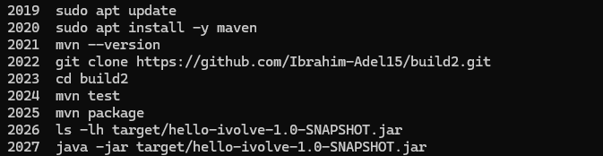
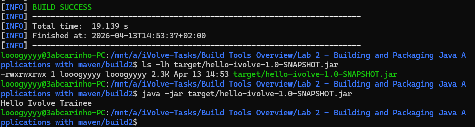

# Lab 2: Building and Packaging Java Applications with Maven

## Overview
This lab demonstrates how to build and package a Java application using Maven. It covers installing Maven, cloning the source code, running unit tests, generating a JAR artifact, and verifying the application runs as expected.

## Tools Used
- **Maven** – Build automation tool used to compile, test, and package the Java application.
- **Java JDK** – Required runtime and compiler for the application.
- **Git** – Used to clone the source code from GitHub.

## Outcome
By the end of the lab, a fully packaged Java application (`hello-ivolve-1.0-SNAPSHOT.jar`) was built from source, tested, and confirmed to be running correctly.

### Commands History

### Application Running

