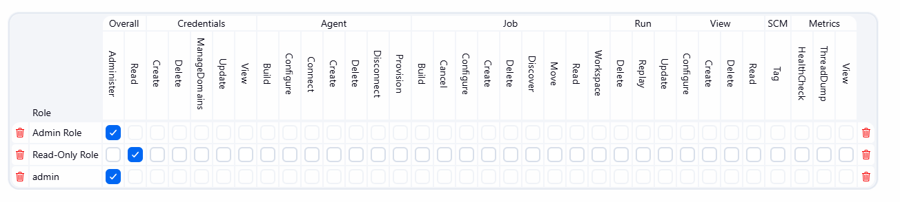
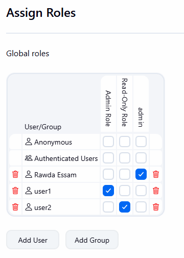

# Lab 21: Role-Based Authorization in Jenkins

## Overview
This lab demonstrates how to configure Role-Based Access Control (RBAC) in Jenkins using the Role Strategy Plugin. Two users were created and assigned different roles to enforce the principle of least privilege — one user with full admin access and another with read-only access.

## Tools Used
- **Jenkins** – CI/CD platform where RBAC is configured.
- **Role Strategy Plugin** – Jenkins plugin used to define and assign roles to users.

## Outcome
Two roles were created: `Admin Role` with full administrative permissions and `Read-Only Role` with read-only access. `user1` was assigned the `Admin Role` and `user2` was assigned the `Read-Only Role`, while `Rawda Essam` retained the built-in `admin` role. This ensures each user can only perform actions within their assigned permissions.

### Roles Configuration

### Assign Roles
