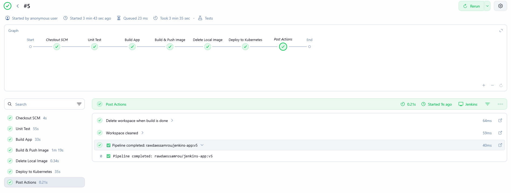

# Lab 22: Jenkins Pipeline for Application Deployment

## Overview
This lab demonstrates how to build a fully automated Jenkins CI/CD pipeline that takes an application from source code all the way to a running Kubernetes deployment. The pipeline handles unit testing, building, containerizing, pushing to DockerHub, and deploying to a Kubernetes cluster — with post-action notifications for all outcomes.

## Pipeline Stages

**Unit Test** — Installs the application dependencies and runs the test suite to ensure the code is working correctly before proceeding.

**Build App** — Compiles and builds the application artifacts that will be packaged into the Docker image.

**Build & Push Image** — Builds a Docker image tagged with the Jenkins build number for versioning, then authenticates with DockerHub using stored credentials and pushes the image to the registry.

**Delete Local Image** — Removes the image from the local Docker daemon after it has been pushed, keeping the Jenkins agent clean.

**Update Deployment YAML** — Uses `sed` to automatically replace the image tag in `deployment.yaml` with the newly built image version, ensuring the Kubernetes manifest always reflects the latest build.

**Deploy to Kubernetes** — Applies the updated deployment manifest to the cluster and waits for the rollout to complete successfully before marking the stage as passed.

**Post Actions** — The workspace is always cleaned after the build regardless of outcome. A success message logs the deployed image name and tag, while a failure message prompts the user to check the console output.

## Tools Used
- **Jenkins** – CI/CD automation server running the pipeline.
- **Docker** – Used to build and push the application image.
- **DockerHub** – Registry where the versioned image is stored.
- **kubectl** – Used to apply the updated manifest and verify the rollout.
- **GitHub** – Source of the application code, Dockerfile, and Jenkinsfile.

## Outcome
The pipeline ran successfully through all 7 stages. The Docker image was tagged with the build number (`v5`), pushed to DockerHub as `rawdaessamrou/jenkins-app:v5`, and deployed to the Kubernetes cluster. The workspace was cleaned after the build as part of the post actions.

### Pipeline Run
