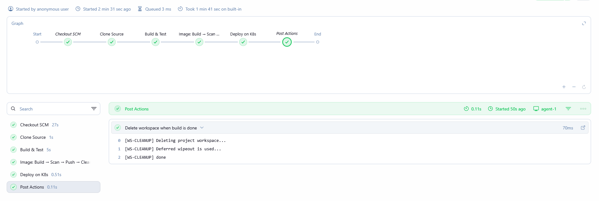

# Lab 23: CI/CD Pipeline Implementation with Jenkins Agents and Shared Libraries

## Overview
This lab demonstrates how to build a production-style CI/CD pipeline using Jenkins agents and shared libraries. Rather than writing all pipeline logic inline, the heavy lifting is offloaded to reusable shared library functions, keeping the Jenkinsfile clean and maintainable. The pipeline runs on a dedicated Jenkins agent (`agent-1`) instead of the built-in node, simulating a real distributed Jenkins setup.

## Shared Library
The pipeline loads the `my-shared-library` shared library which provides three reusable functions covering the full application lifecycle — building and testing the app, managing the Docker image (build, scan, push, and cleanup), and deploying to Kubernetes. This demonstrates how the same shared library functions can be reused across multiple pipelines without code duplication.

## Pipeline Stages

**Clone Source** — Checks out the application source code from the configured SCM repository.

**Build & Test** — Calls the `buildAndTest` shared library function to compile the Java application with Maven and verify that unit tests pass.

**Image: Build → Scan → Push → Cleanup** — Calls the `imageLifecycle` shared library function with the image name (tagged with the build ID) and DockerHub credentials. This builds the Docker image, scans it for vulnerabilities with Trivy, pushes it to DockerHub, and removes it locally.

**Deploy on K8s** — Calls the `deployOnK8s` shared library function to apply the deployment manifest to the Kubernetes cluster using the kubeconfig stored as a Jenkins credential.

**Post Actions** — The workspace is always cleaned after the build regardless of outcome using `cleanWs()`.

## Jenkins Agent
The pipeline is configured to run on `agent-1`, a dedicated Jenkins slave node. This separates the workload from the Jenkins controller and reflects how pipelines are executed in real-world environments where agents handle the actual build and deployment tasks.

## Tools Used
- **Jenkins** – CI/CD automation server running the pipeline.
- **Jenkins Agent (agent-1)** – Dedicated slave node that executes the pipeline stages.
- **Maven** – Compiles and packages the Java application.
- **Docker** – Builds and pushes the application image.
- **Trivy** – Scans the Docker image for vulnerabilities.
- **kubectl** – Deploys the application to the Kubernetes cluster.
- **Jenkins Shared Library** – Centralizes reusable pipeline logic across projects.

## Outcome
The pipeline ran successfully through all stages on `agent-1`. The shared library functions were loaded and executed correctly, and the workspace was cleaned after the build completed.

### Pipeline Run
