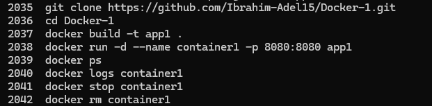
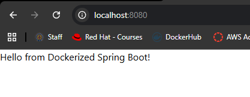

# Lab 3: Run Java Spring Boot App in a Container

## Overview
This lab demonstrates how to containerize a Java Spring Boot application using Docker. It covers cloning the source code, writing a Dockerfile, building a Docker image, running a container, and verifying the application is accessible via a web browser.

## Dockerfile
```dockerfile
FROM maven:3.9.6-eclipse-temurin-17  

WORKDIR /app                   

COPY . . 

RUN mvn package -DskipTests

EXPOSE 8080
                           
CMD ["java", "-jar", "target/demo-0.0.1-SNAPSHOT.jar"]  
```

## Tools Used
- **Docker** – Used to build the image and run the container.
- **Maven** – Used inside the container to build the Java application.
- **Java 17** – Runtime for the Spring Boot application.
- **Git** – Used to clone the source code from GitHub.

## Outcome
A Docker image named `app1` was built from the source code and a container named `container1` was launched from it. The Spring Boot application was accessible at `localhost:8080`, returning the expected response. The container was then stopped and removed.

### Commands History


### Application Running

