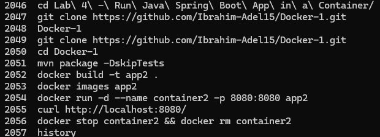
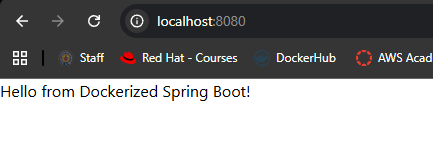

# Lab 4: Run Java Spring Boot App in a Container

## Overview
This lab demonstrates an alternative approach to containerizing a Java Spring Boot application. Unlike Lab 3, the application is built **outside** the container first using Maven, and only the JAR file is copied into the image. This results in a smaller, leaner Docker image compared to using a Maven base image.

## Dockerfile
```dockerfile
FROM eclipse-temurin:17

WORKDIR /app

COPY target/demo-0.0.1-SNAPSHOT.jar app.jar

EXPOSE 8080

ENTRYPOINT ["java", "-jar", "app.jar"]
```

## Tools Used
- **Docker** – Used to build the image and run the container.
- **Maven** – Used on the host machine to build the JAR before containerizing.
- **Java 17** – Runtime for the Spring Boot application.
- **Git** – Used to clone the source code from GitHub.

## Outcome
The application was built locally and the JAR was packaged into a Docker image named `app2`. A container named `container2` was launched from it and the Spring Boot application was accessible at `localhost:8080`, returning the expected response. The container was then stopped and removed.

### Commands History


### Application Running

