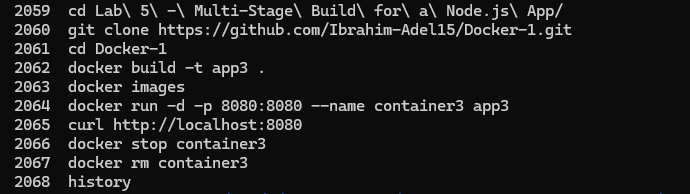

# Lab 5: Multi-Stage Build for a Java Spring Boot App

## Overview
This lab demonstrates the use of Docker multi-stage builds to produce an optimized container image for a Java Spring Boot application. The build is split into two stages: the first handles compilation and packaging using Maven, and the second produces a minimal runtime image containing only the JAR file. This approach significantly reduces the final image size compared to Labs 3 and 4.

## Dockerfile
```dockerfile
# Stage 1: Build
FROM maven:3.9.6-eclipse-temurin-17 AS builder

WORKDIR /app

COPY . .

RUN mvn clean package -DskipTests

# Stage 2: Run
FROM eclipse-temurin:17-jdk-alpine

WORKDIR /app

COPY --from=builder /app/target/*.jar app.jar

EXPOSE 8080

ENTRYPOINT ["java", "-jar", "app.jar"]
```

## Tools Used
- **Docker** – Used to build the multi-stage image and run the container.
- **Maven** – Used in the build stage to compile and package the application.
- **Java 17 (Alpine)** – Lightweight runtime image used in the final stage.
- **Git** – Used to clone the source code from GitHub.

## Outcome
A multi-stage Docker image named `app3` was built. The final image is significantly smaller than the ones in previous labs since it only contains the runtime and the JAR, not the full Maven toolchain. A container named `container3` was launched and the application was accessible at `localhost:8080`. The container was then stopped and removed.

### Commands History


### Application Running

