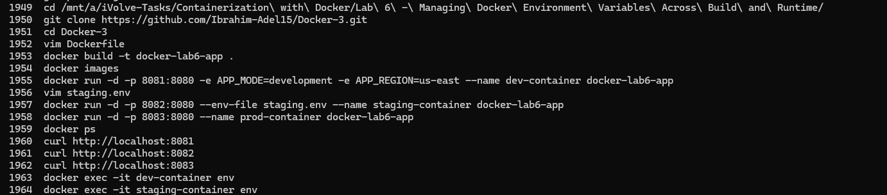
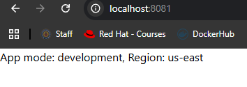
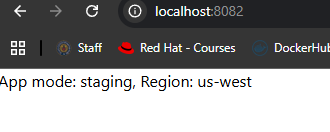
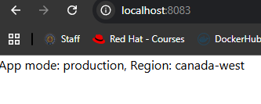

# Lab 6: Managing Docker Environment Variables Across Build and Runtime

## Overview
This lab demonstrates three different ways to pass environment variables to Docker containers. The same image was used to run three containers, each with different configurations for `APP_MODE` and `APP_REGION`, showcasing how Docker handles environment variables at both build time and runtime.

## Dockerfile
```dockerfile
FROM python:3.9-slim

WORKDIR /app

COPY . /app

RUN pip install flask

EXPOSE 8080

ENV APP_MODE=production
ENV APP_REGION=canada-west

CMD ["python", "app.py"]
```

## Environment Variable Methods

| Container | APP_MODE | APP_REGION | Method |
|---|---|---|---|
| dev-container | development | us-east | Passed inline via `-e` flags in the run command |
| staging-container | staging | us-west | Loaded from a `staging.env` file using `--env-file` |
| prod-container | production | canada-west | Set directly in the Dockerfile using `ENV` |

## Tools Used
- **Docker** – Used to build the image and run the containers.
- **Python 3.9 (slim)** – Lightweight base image for the Flask application.
- **Flask** – Python web framework used to serve the app.
- **Git** – Used to clone the source code from GitHub.

## Outcome
A single Docker image named `docker-lab6-app` was built and used to run three containers simultaneously, each reflecting a different environment configuration. The correct variables were confirmed by accessing each container on its respective port (8081, 8082, 8083).


### Commands History


### dev-container (localhost:8081)


### staging-container (localhost:8082)


### prod-container (localhost:8083)

