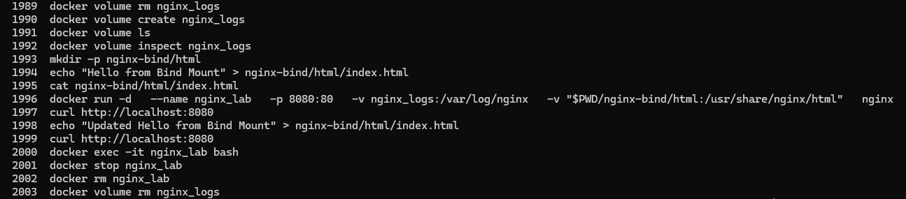
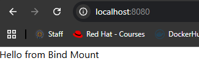
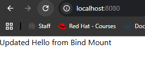

# Lab 7: Docker Volume and Bind Mount with Nginx

## Overview
This lab demonstrates two Docker storage mechanisms — **volumes** and **bind mounts** — using an Nginx container. A named volume is used to persist Nginx logs, while a bind mount links a local directory to the container's web root, allowing real-time content updates without rebuilding the image.

## Key Concepts

- **Named Volume (`nginx_logs`)** – Created to persist Nginx access and error logs at `/var/log/nginx` inside the container. The volume is managed by Docker and stored in the default Docker volumes path.
- **Bind Mount (`nginx-bind/html`)** – A local directory on the host is mounted to `/usr/share/nginx/html` inside the container. Any change made to the HTML file on the host is immediately reflected in the running container without a restart.

## Tools Used
- **Docker** – Used to create volumes, run the container, and manage storage.
- **Nginx** – Web server used to serve the custom HTML content.

## Outcome
The Nginx container was launched with both a named volume and a bind mount. The custom HTML page was served and verified via `curl`. After updating the `index.html` file on the host machine, the change was immediately reflected without restarting the container, confirming the bind mount was working correctly. Logs were persisted in the `nginx_logs` volume, which was then deleted after verification.

### Commands History

### Before Update

### After Update

