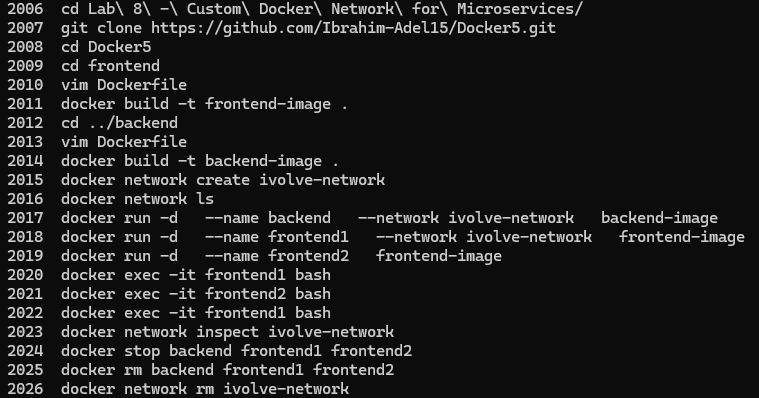
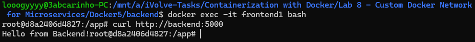
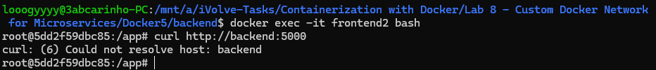

# Lab 8: Custom Docker Network for Microservices

## Overview
This lab demonstrates how Docker custom networks enable isolated communication between containers. A frontend and backend service were containerized separately, and a custom network was used to control which containers could communicate with each other.

## Dockerfiles

### Frontend
```dockerfile
FROM python:3.10

WORKDIR /app

COPY . .

RUN pip install -r requirements.txt

EXPOSE 5000

CMD ["python", "app.py"]
```

### Backend
```dockerfile
FROM python:3.10

WORKDIR /app

COPY . .

RUN pip install flask

EXPOSE 5000

CMD ["python", "app.py"]
```

## Tools Used
- **Docker** – Used to build images, create the custom network, and run the containers.
- **Python 3.10 / Flask** – Used for both the frontend and backend services.
- **Git** – Used to clone the source code from GitHub.

## Network Behavior

| Container | Network | Can reach backend? |
|---|---|---|
| frontend1 | ivolve-network | ✅ Yes |
| frontend2 | default (bridge) | ❌ No |

## Outcome
A custom Docker network named `ivolve-network` was created. The backend container and `frontend1` were attached to it, allowing `frontend1` to successfully reach the backend by container name. `frontend2` was run on the default network and could not resolve the backend hostname, confirming that Docker custom networks provide DNS-based isolation between containers. The network was deleted after verification.

### Commands History


### frontend1 (on ivolve-network) — Communication Successful


### frontend2 (on default network) — Communication Failed

