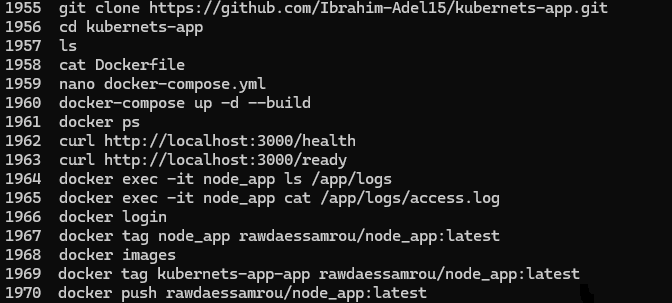
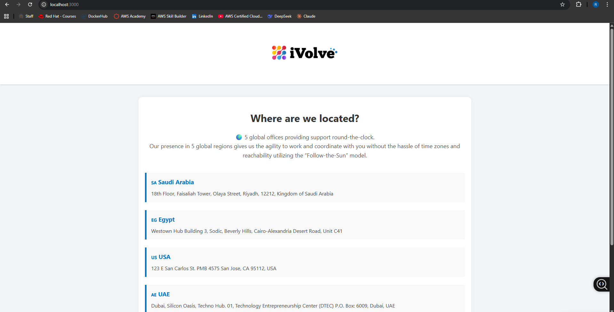
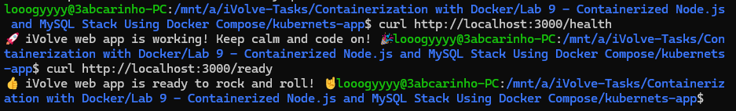
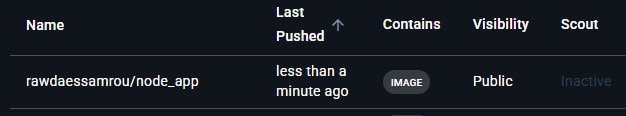

# Lab 9: Containerized Node.js and MySQL Stack Using Docker Compose

## Overview
This lab demonstrates how to use Docker Compose to orchestrate a multi-container application consisting of a Node.js backend and a MySQL database. Docker Compose manages both services, their dependencies, environment variables, and persistent storage in a single configuration file.

## Dockerfile
```dockerfile
FROM node:18-alpine

WORKDIR /app

COPY package.json ./

RUN npm install

COPY . .

EXPOSE 3000

CMD ["node", "server.js"]
```

## docker-compose.yml
```yaml
version: '3.8'

services:
  app:
    build: .
    container_name: node_app
    ports:
      - "3000:3000"
    environment:
      DB_HOST: db
      DB_USER: root
      DB_PASSWORD: root
    depends_on:
      - db

  db:
    image: mysql:8
    container_name: mysql_db
    restart: always
    environment:
      MYSQL_ROOT_PASSWORD: root
      MYSQL_DATABASE: ivolve
    volumes:
      - db_data:/var/lib/mysql

volumes:
  db_data:
```

## Tools Used
- **Docker Compose** – Used to define and run the multi-container stack.
- **Node.js 18 (Alpine)** – Lightweight base image for the application.
- **MySQL 8** – Database service used by the application.
- **DockerHub** – Used to push and host the final application image.
- **Git** – Used to clone the source code from GitHub.

## Outcome
The Node.js and MySQL stack was launched using a single `docker-compose up` command. The application was verified at `localhost:3000`, with health and readiness endpoints responding correctly at `/health` and `/ready`. Access logs were confirmed inside the container at `/app/logs/`. The final image was tagged and pushed to DockerHub.

### Commands History


### Application Running


### Health & Ready Endpoints


### DockerHub

