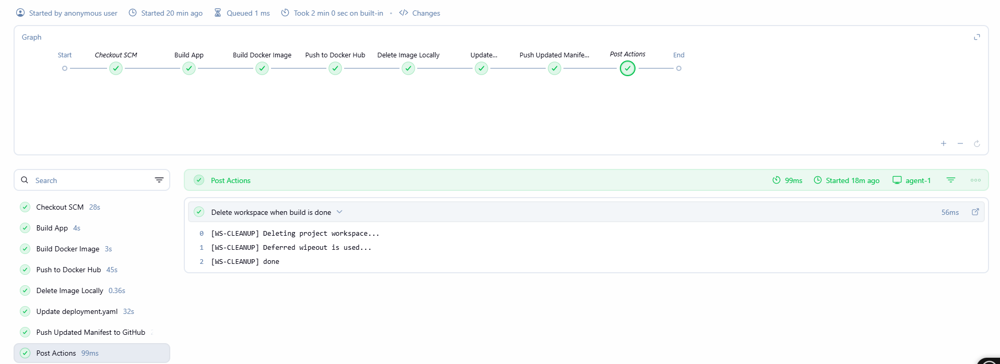
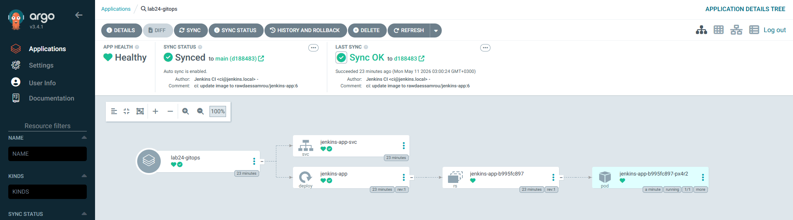
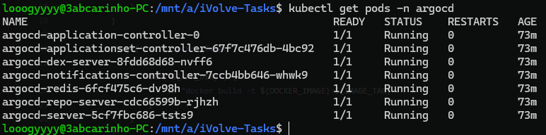

# Lab 24: GitOps Workflow

## Overview
This lab demonstrates a complete GitOps workflow by integrating Jenkins and ArgoCD. Jenkins handles the CI side — building, containerizing, and pushing the application — then updates the deployment manifest in the GitHub repository. ArgoCD continuously watches the repository and automatically syncs any changes to the Kubernetes cluster, eliminating the need for Jenkins to interact with `kubectl` directly.

## How It Works

The workflow is split into two parts:

**CI (Jenkins)** — The pipeline builds the application, creates a Docker image tagged with the build number, pushes it to DockerHub, removes it locally, then updates the image tag in `deployment.yaml` and pushes the updated file back to the GitHub repository.

**CD (ArgoCD)** — ArgoCD is configured to watch the GitHub repository. Once it detects the updated manifest, it automatically syncs the new deployment to the Kubernetes cluster without any manual intervention.

## Pipeline Stages

**Build App** — Compiles the Java application using Maven.

**Build Docker Image** — Builds the Docker image from the application's Dockerfile, tagged with the current build ID.

**Push to Docker Hub** — Authenticates with DockerHub and pushes the newly built image to the registry.

**Delete Image Locally** — Removes the image from the Jenkins agent's local Docker daemon.

**Update deployment.yaml** — Replaces the image tag in the deployment manifest with the new version using `sed`.

**Push Updated Manifest to GitHub** — Commits and pushes the updated `deployment.yaml` back to the GitHub repository, triggering ArgoCD to detect the change.

**Post Actions** — The workspace is always cleaned after the build completes.

## ArgoCD Configuration
ArgoCD was installed in the Kubernetes cluster in the `argocd` namespace. An application named `lab24-gitops` was created pointing to the GitHub repository. Auto-sync was enabled so ArgoCD automatically applies any manifest changes without manual intervention.

## Tools Used
- **Jenkins** – Runs the CI pipeline on `agent-1`.
- **Docker** – Builds and pushes the application image.
- **DockerHub** – Hosts the versioned application image.
- **GitHub** – Stores the application source code and Kubernetes manifests.
- **ArgoCD** – Watches the GitHub repository and syncs changes to the cluster automatically.
- **kubectl** – Used to verify ArgoCD pods and deployment status on the cluster.

## Outcome
The Jenkins pipeline ran successfully through all stages. The updated `deployment.yaml` was pushed to GitHub with the new image tag. ArgoCD detected the change, synced the application, and deployed it to the cluster — confirmed as **Healthy** and **Synced** in the ArgoCD dashboard.

### Jenkins Pipeline

### ArgoCD Sync

### Verify on Cluster
