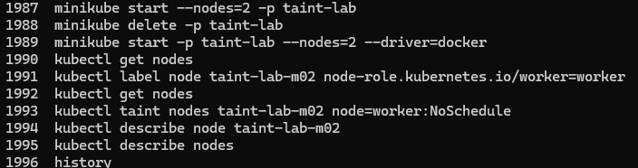
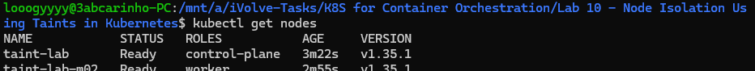
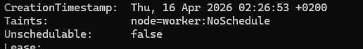
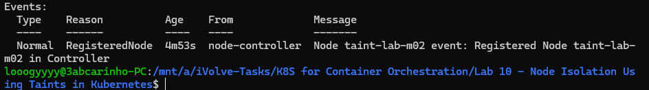

# Lab 10: Node Isolation Using Taints in Kubernetes

## Overview
This lab demonstrates how to use Kubernetes taints to control pod scheduling. A two-node cluster was created using Minikube, and a taint with the `NoSchedule` effect was applied to the worker node to prevent pods from being scheduled on it unless they explicitly tolerate that taint.

## Tools Used
- **Minikube** – Used to create a local Kubernetes cluster with 2 nodes.
- **kubectl** – Used to manage nodes, apply taints, and verify the cluster state.

## Outcome
A Kubernetes cluster named `taint-lab` was created with one control-plane node and one worker node. The worker node `taint-lab-m02` was labeled and then tainted with `node=worker:NoSchedule`. The taint was verified by describing the node, confirming that no pods will be scheduled on it unless they have a matching toleration.

### Commands History

### Nodes

### Taint Applied

### Events

