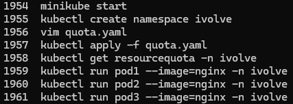
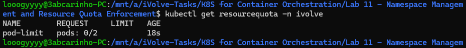
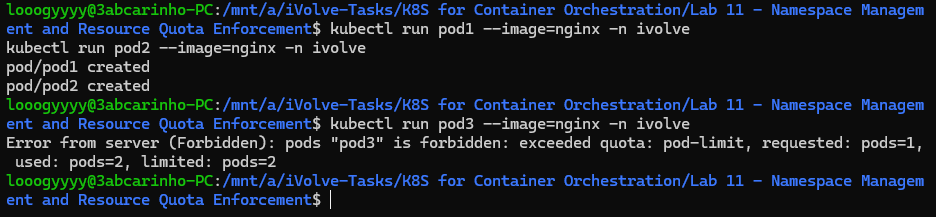

# Lab 11: Namespace Management and Resource Quota Enforcement

## Overview
This lab demonstrates how to use Kubernetes namespaces and resource quotas to enforce resource boundaries. A dedicated namespace was created and a quota was applied to limit the number of pods that can run within it, preventing resource overuse in a shared cluster.

## quota.yaml
```yaml
apiVersion: v1
kind: ResourceQuota
metadata:
  name: pod-limit
  namespace: ivolve
spec:
  hard:
    pods: "2"
```

## Tools Used
- **Minikube** – Used to run the local Kubernetes cluster.
- **kubectl** – Used to create the namespace, apply the quota, and run pods.

## Outcome
A namespace named `ivolve` was created and a `ResourceQuota` limiting the namespace to 2 pods was applied. `pod1` and `pod2` were created successfully, but attempting to create `pod3` was rejected with a `Forbidden` error, confirming that the quota was enforced correctly.

### Commands History


### Resource Quota


### Quota Enforcement Verified

