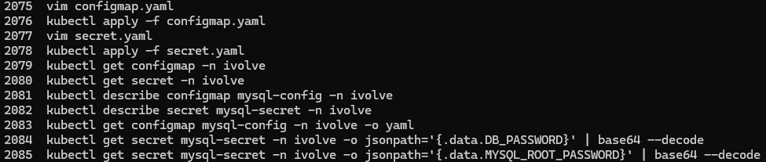
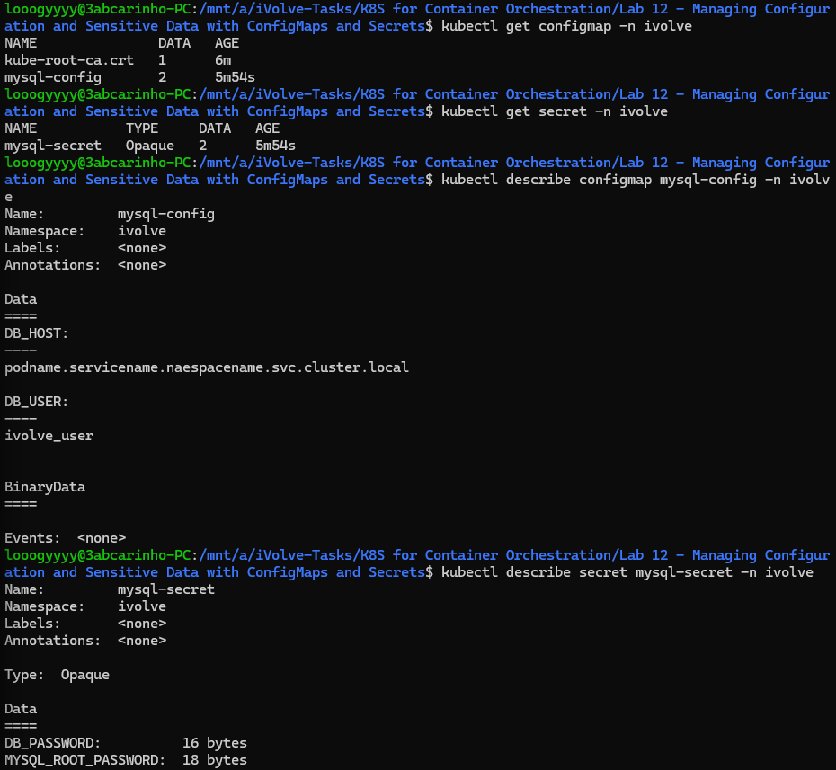
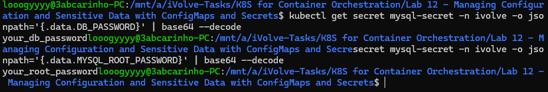

# Lab 12: Managing Configuration and Sensitive Data with ConfigMaps and Secrets

## Overview
This lab demonstrates how Kubernetes separates non-sensitive configuration from sensitive credentials using ConfigMaps and Secrets. The ConfigMap stores general database connection settings, while the Secret stores sensitive passwords encoded in base64, keeping them out of plain-text configuration files.

## configmap.yaml
```yaml
apiVersion: v1
kind: ConfigMap
metadata:
  name: mysql-config
  namespace: ivolve
data:
  DB_HOST: podname.servicename.naespacename.svc.cluster.local
  DB_USER: ivolve_user
```

## secret.yaml
```yaml
apiVersion: v1
kind: Secret
metadata:
  name: mysql-secret
  namespace: ivolve
type: Opaque
data:
  DB_PASSWORD: eW91cl9kYl9wYXNzd29yZA==
  MYSQL_ROOT_PASSWORD: eW91cl9yb290X3Bhc3N3b3Jk
```

## Tools Used
- **kubectl** – Used to apply and verify the ConfigMap and Secret.
- **base64** – Used to encode sensitive values before storing them in the Secret.

## Outcome
The ConfigMap and Secret were successfully applied to the `ivolve` namespace. Non-sensitive variables (`DB_HOST`, `DB_USER`) were stored in the ConfigMap, while sensitive credentials (`DB_PASSWORD`, `MYSQL_ROOT_PASSWORD`) were base64-encoded and stored in an Opaque Secret. The Secret values were decoded and verified using `kubectl get secret` with a jsonpath filter.

### Commands History


### ConfigMap & Secret Description


### Decoded Secret Values
