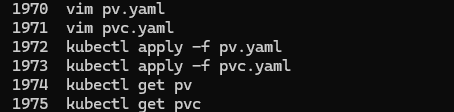
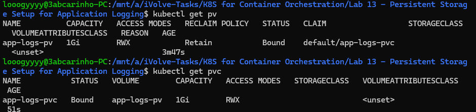

# Lab 13: Persistent Storage Setup for Application Logging

## Overview
This lab demonstrates how to set up persistent storage in Kubernetes using a PersistentVolume (PV) and PersistentVolumeClaim (PVC). The storage is intended for application logging, allowing multiple pod replicas to read and write logs to a shared volume that persists beyond the pod lifecycle.

## pv.yaml
```yaml
apiVersion: v1
kind: PersistentVolume
metadata:
  name: app-logs-pv
spec:
  capacity:
    storage: 1Gi
  accessModes:
    - ReadWriteMany
  persistentVolumeReclaimPolicy: Retain
  hostPath:
    path: /mnt/app-logs
```

## pvc.yaml
```yaml
apiVersion: v1
kind: PersistentVolumeClaim
metadata:
  name: app-logs-pvc
spec:
  storageClassName: ""
  accessModes:
    - ReadWriteMany
  resources:
    requests:
      storage: 1Gi
```

## Tools Used
- **kubectl** – Used to apply and verify the PV and PVC.

## Outcome
A 1Gi PersistentVolume backed by a `hostPath` at `/mnt/app-logs` was created with a `Retain` reclaim policy and `ReadWriteMany` access mode. A PVC was then created with matching specifications and successfully bound to the PV, confirming the storage is ready to be used by application pods.

### Commands History


### Verification

