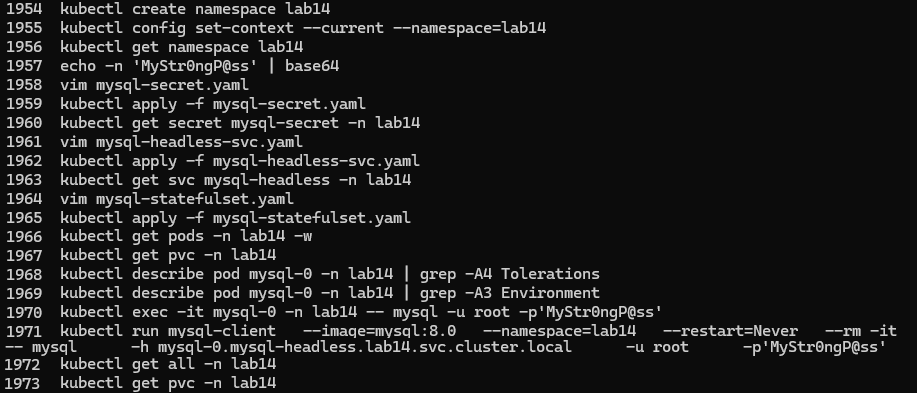
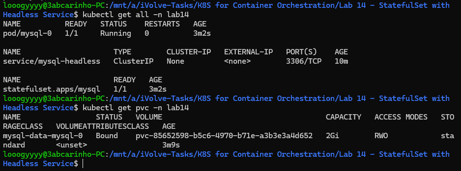
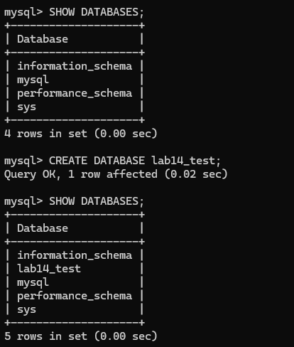
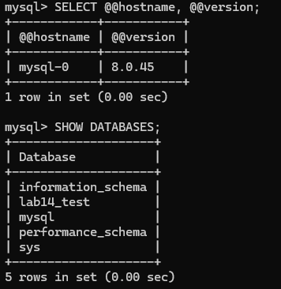

# Lab 14: StatefulSet with Headless Service

## Overview
This lab demonstrates how to deploy a stateful application (MySQL) in Kubernetes using a StatefulSet and a headless service. Unlike Deployments, StatefulSets provide stable pod identities and ordered deployment, making them suitable for databases. A headless service enables direct DNS-based access to individual pods, and a PVC ensures data persists across pod restarts.

## mysql-secret.yaml
```yaml
apiVersion: v1
kind: Secret
metadata:
  name: mysql-secret
  namespace: lab14
type: Opaque
data:
  mysql-root-password: TXlTdHIwbmdQQHNz
```

## mysql-headless-svc.yaml
```yaml
apiVersion: v1
kind: Service
metadata:
  name: mysql-headless
  namespace: lab14
  labels:
    app: mysql
spec:
  clusterIP: None
  selector:
    app: mysql
  ports:
    - name: mysql
      port: 3306
      targetPort: 3306
```

## mysql-statefulset.yaml
```yaml
apiVersion: apps/v1
kind: StatefulSet
metadata:
  name: mysql
  namespace: lab14
spec:
  serviceName: mysql-headless
  replicas: 1
  selector:
    matchLabels:
      app: mysql
  template:
    metadata:
      labels:
        app: mysql
    spec:
      tolerations:
        - key: "node"
          operator: "Equal"
          value: "worker"
          effect: "NoSchedule"
      containers:
        - name: mysql
          image: mysql:8.0
          ports:
            - containerPort: 3306
          env:
            - name: MYSQL_ROOT_PASSWORD
              valueFrom:
                secretKeyRef:
                  name: mysql-secret
                  key: mysql-root-password
          volumeMounts:
            - name: mysql-data
              mountPath: /var/lib/mysql
  volumeClaimTemplates:
    - metadata:
        name: mysql-data
      spec:
        accessModes: ["ReadWriteOnce"]
        storageClassName: standard
        resources:
          requests:
            storage: 2Gi
```

## Tools Used
- **kubectl** – Used to apply manifests and verify resources.
- **MySQL 8.0** – Database engine deployed via StatefulSet.
- **Kubernetes Secret** – Used to securely inject the root password.
- **Headless Service** – Provides stable DNS entries for StatefulSet pods.

## Outcome
A MySQL StatefulSet was deployed in the `lab14` namespace with a toleration for the `node=worker:NoSchedule` taint, allowing it to schedule on the tainted worker node. The root password was injected from a Secret. A 2Gi PVC was automatically provisioned and bound to the pod. The headless service exposed the pod via DNS at `mysql-0.mysql-headless.lab14.svc.cluster.local`. A MySQL client connected successfully and confirmed the database was operational by creating and verifying a test database.

### Commands History


### Verification


### Show Databases


### Hostname and Version
