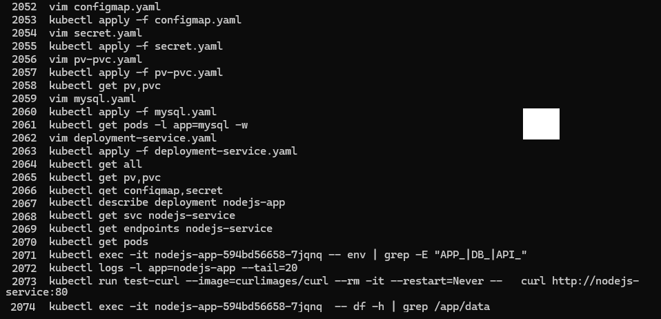
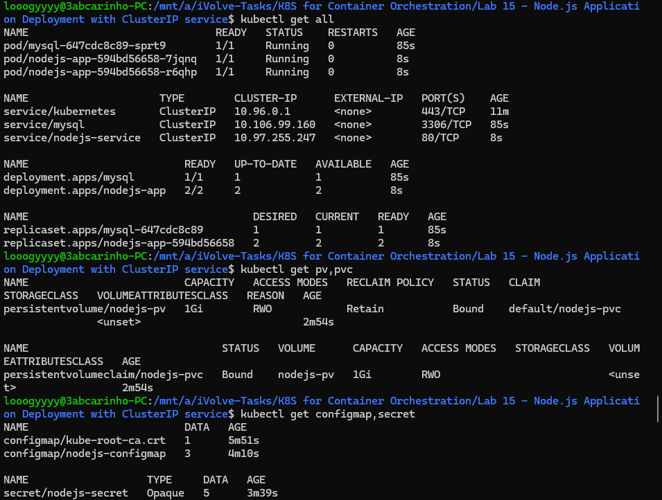
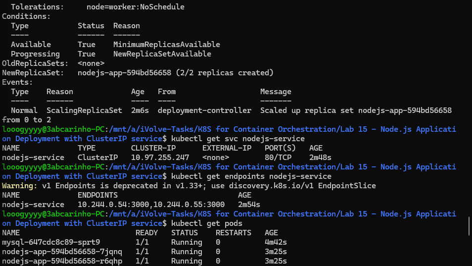
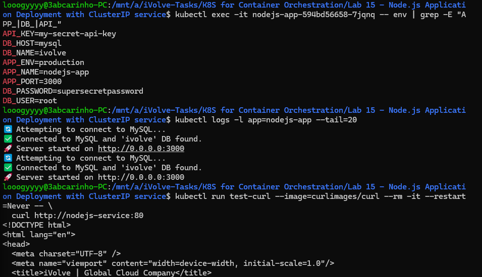
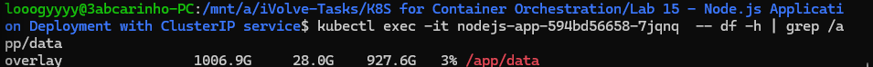

# Lab 15: Node.js Application Deployment with ClusterIP Service

## Overview
This lab demonstrates a full Node.js application deployment in Kubernetes, integrating multiple concepts from previous labs. The application is deployed with 2 replicas, consumes configuration from a ConfigMap and Secret, mounts a PersistentVolume for storage, tolerates a node taint, and is exposed internally via a ClusterIP service. A MySQL deployment is included as the database backend.

## configmap.yaml
```yaml
apiVersion: v1
kind: ConfigMap
metadata:
  name: nodejs-configmap
data:
  APP_PORT: "3000"
  APP_ENV: "production"
  APP_NAME: "nodejs-app"
```

## secret.yaml
```yaml
apiVersion: v1
kind: Secret
metadata:
  name: nodejs-secret
type: Opaque
stringData:
  DB_HOST: "mysql"
  DB_USER: "root"
  DB_PASSWORD: "supersecretpassword"
  DB_NAME: "ivolve"
  API_KEY: "my-secret-api-key"
```

## pv-pvc.yaml
```yaml
apiVersion: v1
kind: PersistentVolume
metadata:
  name: nodejs-pv
spec:
  capacity:
    storage: 1Gi
  accessModes:
    - ReadWriteOnce
  persistentVolumeReclaimPolicy: Retain
  storageClassName: ""
  hostPath:
    path: /mnt/data/nodejs
---
apiVersion: v1
kind: PersistentVolumeClaim
metadata:
  name: nodejs-pvc
spec:
  accessModes:
    - ReadWriteOnce
  resources:
    requests:
      storage: 1Gi
  storageClassName: ""
  volumeName: nodejs-pv
```

## mysql.yaml
```yaml
apiVersion: v1
kind: Service
metadata:
  name: mysql
spec:
  selector:
    app: mysql
  ports:
    - port: 3306
      targetPort: 3306
---
apiVersion: apps/v1
kind: Deployment
metadata:
  name: mysql
spec:
  replicas: 1
  selector:
    matchLabels:
      app: mysql
  template:
    metadata:
      labels:
        app: mysql
    spec:
      containers:
        - name: mysql
          image: mysql:8.0
          env:
            - name: MYSQL_ROOT_PASSWORD
              value: "supersecretpassword"
            - name: MYSQL_DATABASE
              value: "ivolve"
          ports:
            - containerPort: 3306
```

## deployment-service.yaml
```yaml
apiVersion: apps/v1
kind: Deployment
metadata:
  name: nodejs-app
  labels:
    app: nodejs-app
spec:
  replicas: 2
  selector:
    matchLabels:
      app: nodejs-app
  template:
    metadata:
      labels:
        app: nodejs-app
    spec:
      tolerations:
        - key: "node"
          operator: "Equal"
          value: "worker"
          effect: "NoSchedule"
      containers:
        - name: nodejs-app
          image: rawdaessamrou/node_app:latest
          ports:
            - containerPort: 3000
          envFrom:
            - configMapRef:
                name: nodejs-configmap
            - secretRef:
                name: nodejs-secret
          volumeMounts:
            - name: nodejs-storage
              mountPath: /app/data
      volumes:
        - name: nodejs-storage
          persistentVolumeClaim:
            claimName: nodejs-pvc
---
apiVersion: v1
kind: Service
metadata:
  name: nodejs-service
spec:
  type: ClusterIP
  selector:
    app: nodejs-app
  ports:
    - protocol: TCP
      port: 80
      targetPort: 3000
```

## Tools Used
- **kubectl** – Used to apply manifests and verify all resources.
- **Node.js (custom DockerHub image)** – Application image used for the deployment.
- **MySQL 8.0** – Database backend deployed alongside the app.
- **ClusterIP Service** – Exposes the Node.js app internally within the cluster.

## Outcome
The Node.js deployment was created with 2 replicas, each pod inheriting environment variables from the ConfigMap and Secret, and mounting the PVC at `/app/data`. The toleration allowed pods to schedule on the tainted worker node. The ClusterIP service successfully load-balanced traffic across both replicas. The application connected to the MySQL `ivolve` database, and a test curl confirmed the service was reachable and returning the expected HTML response.

### Commands History


### Verify All Resources


### Service and Endpoints


### Environment Variables and Logs


### Persistent Volume Mount
