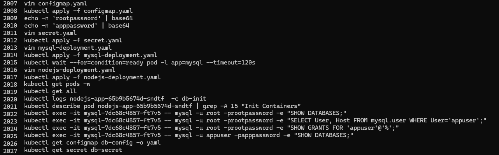
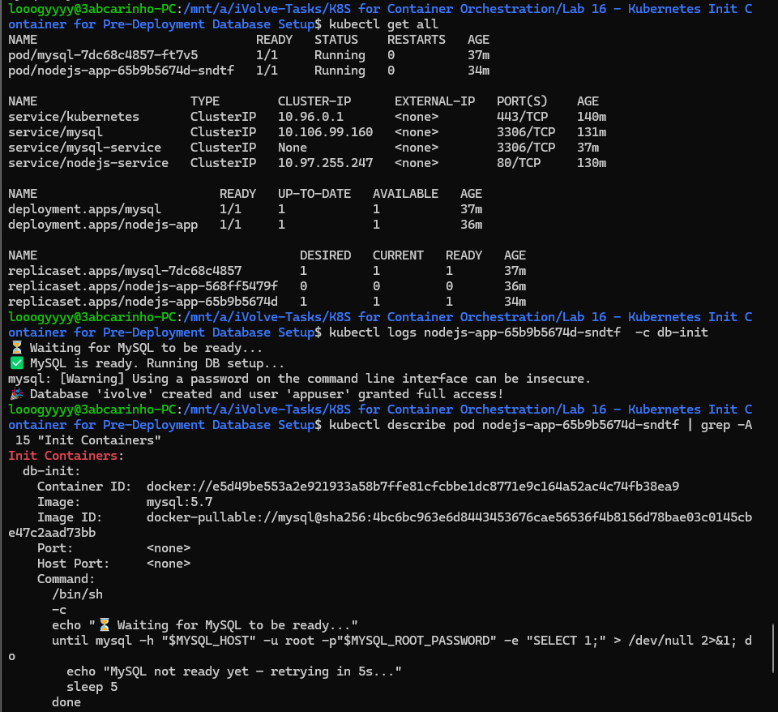
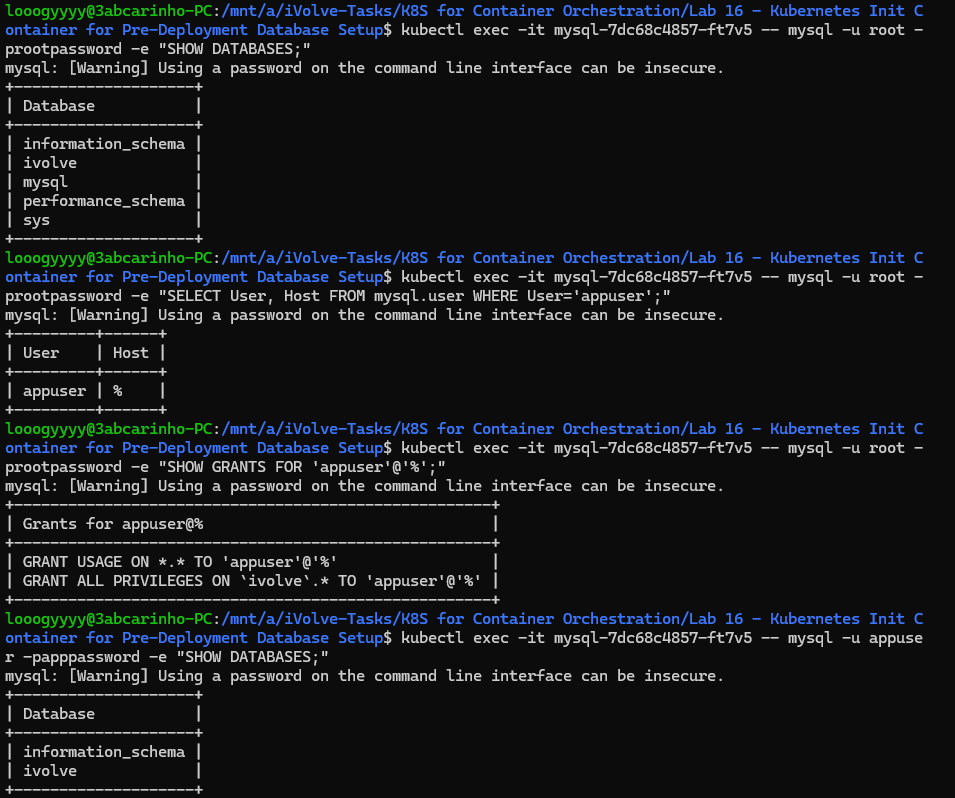
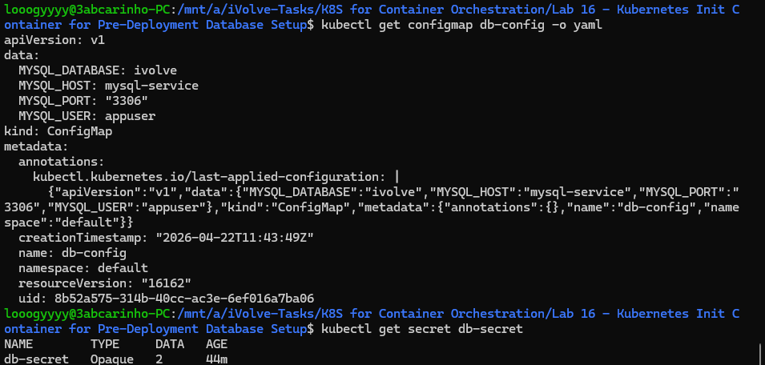

# Lab 16: Kubernetes Init Container for Pre-Deployment Database Setup

## Overview
This lab demonstrates how to use a Kubernetes init container to perform database setup before the main application starts. The init container waits for MySQL to be ready, then creates the `ivolve` database and grants the application user full access — ensuring the database is properly initialized before the Node.js app begins accepting traffic.

## configmap.yaml
```yaml
apiVersion: v1
kind: ConfigMap
metadata:
  name: db-config
  namespace: default
data:
  MYSQL_HOST: "mysql-service"
  MYSQL_PORT: "3306"
  MYSQL_DATABASE: "ivolve"
  MYSQL_USER: "appuser"
```

## secret.yaml
```yaml
apiVersion: v1
kind: Secret
metadata:
  name: db-secret
  namespace: default
type: Opaque
data:
  MYSQL_ROOT_PASSWORD: cm9vdHBhc3N3b3Jk
  MYSQL_APP_PASSWORD: YXBwcGFzc3dvcmQ=
```

## mysql-deployment.yaml
```yaml
apiVersion: v1
kind: Service
metadata:
  name: mysql-service
spec:
  selector:
    app: mysql
  ports:
    - port: 3306
      targetPort: 3306
  clusterIP: None
---
apiVersion: apps/v1
kind: Deployment
metadata:
  name: mysql
spec:
  replicas: 1
  selector:
    matchLabels:
      app: mysql
  template:
    metadata:
      labels:
        app: mysql
    spec:
      containers:
        - name: mysql
          image: mysql:5.7
          env:
            - name: MYSQL_ROOT_PASSWORD
              valueFrom:
                secretKeyRef:
                  name: db-secret
                  key: MYSQL_ROOT_PASSWORD
          ports:
            - containerPort: 3306
```

## nodejs-deployment.yaml
```yaml
apiVersion: apps/v1
kind: Deployment
metadata:
  name: nodejs-app
  namespace: default
  labels:
    app: nodejs-app
spec:
  replicas: 1
  selector:
    matchLabels:
      app: nodejs-app
  template:
    metadata:
      labels:
        app: nodejs-app
    spec:
      initContainers:
        - name: db-init
          image: mysql:5.7
          env:
            - name: MYSQL_HOST
              valueFrom:
                configMapKeyRef:
                  name: db-config
                  key: MYSQL_HOST
            - name: MYSQL_ROOT_PASSWORD
              valueFrom:
                secretKeyRef:
                  name: db-secret
                  key: MYSQL_ROOT_PASSWORD
            - name: MYSQL_APP_USER
              valueFrom:
                configMapKeyRef:
                  name: db-config
                  key: MYSQL_USER
            - name: MYSQL_APP_PASSWORD
              valueFrom:
                secretKeyRef:
                  name: db-secret
                  key: MYSQL_APP_PASSWORD
          command:
            - /bin/sh
            - -c
            - |
              until mysql -h "$MYSQL_HOST" -u root -p"$MYSQL_ROOT_PASSWORD" -e "SELECT 1;" > /dev/null 2>&1; do
                sleep 5
              done
              mysql -h "$MYSQL_HOST" -u root -p"$MYSQL_ROOT_PASSWORD" <<EOF
              CREATE DATABASE IF NOT EXISTS ivolve;
              CREATE USER IF NOT EXISTS '${MYSQL_APP_USER}'@'%' IDENTIFIED BY '${MYSQL_APP_PASSWORD}';
              GRANT ALL PRIVILEGES ON ivolve.* TO '${MYSQL_APP_USER}'@'%';
              FLUSH PRIVILEGES;
              EOF
      containers:
        - name: nodejs-app
          image: node_app:latest
          ports:
            - containerPort: 3000
          env:
            - name: DB_HOST
              valueFrom:
                configMapKeyRef:
                  name: db-config
                  key: MYSQL_HOST
            - name: DB_PORT
              valueFrom:
                configMapKeyRef:
                  name: db-config
                  key: MYSQL_PORT
            - name: DB_NAME
              valueFrom:
                configMapKeyRef:
                  name: db-config
                  key: MYSQL_DATABASE
            - name: DB_USER
              valueFrom:
                configMapKeyRef:
                  name: db-config
                  key: MYSQL_USER
            - name: DB_PASSWORD
              valueFrom:
                secretKeyRef:
                  name: db-secret
                  key: MYSQL_APP_PASSWORD
          command: ["node", "server.js"]
```

## Tools Used
- **kubectl** – Used to apply manifests and verify resources.
- **MySQL 5.7** – Used as both the database server and the init container image.
- **Node.js** – Main application container that starts after the init container completes.
- **Kubernetes Init Container** – Ensures the database is ready and configured before the app starts.

## Outcome
The init container `db-init` ran before the Node.js app, polling MySQL until it was ready and then creating the `ivolve` database and the `appuser` with full privileges. Once the init container completed successfully, the main Node.js container started. Manual verification inside the MySQL pod confirmed the database existed, the user was created, and the correct grants were applied.

### Commands History


### All Resources & Init Container Logs


### Database & User Verification


### ConfigMap & Secret
