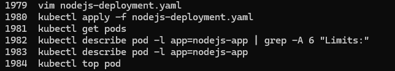
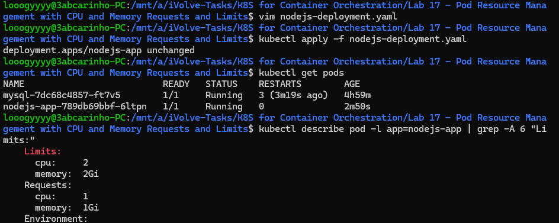
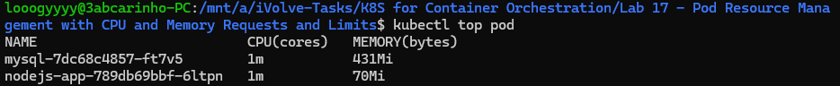

# Lab 17: Pod Resource Management with CPU and Memory Requests and Limits

## Overview
This lab demonstrates how to configure resource requests and limits on Kubernetes pods. Requests define the minimum resources guaranteed to a container, while limits cap the maximum it can consume. This ensures fair resource distribution across the cluster and prevents any single pod from starving others.

## nodejs-deployment.yaml
```yaml
apiVersion: apps/v1
kind: Deployment
metadata:
  name: nodejs-app
  labels:
    app: nodejs-app
spec:
  replicas: 1
  selector:
    matchLabels:
      app: nodejs-app
  template:
    metadata:
      labels:
        app: nodejs-app
    spec:
      initContainers:
        - name: db-init
          image: mysql:5.7
          command:
            - /bin/sh
            - -c
            - |
              until mysql -h "$MYSQL_HOST" -u root -p"$MYSQL_ROOT_PASSWORD" -e "SELECT 1;" > /dev/null 2>&1; do
                sleep 5
              done
              mysql -h "$MYSQL_HOST" -u root -p"$MYSQL_ROOT_PASSWORD" <<EOF
              CREATE DATABASE IF NOT EXISTS ivolve;
              CREATE USER IF NOT EXISTS '${MYSQL_APP_USER}'@'%' IDENTIFIED BY '${MYSQL_APP_PASSWORD}';
              GRANT ALL PRIVILEGES ON ivolve.* TO '${MYSQL_APP_USER}'@'%';
              FLUSH PRIVILEGES;
              EOF
          env:
            - name: MYSQL_HOST
              valueFrom:
                configMapKeyRef:
                  name: db-config
                  key: MYSQL_HOST
            - name: MYSQL_ROOT_PASSWORD
              valueFrom:
                secretKeyRef:
                  name: db-secret
                  key: MYSQL_ROOT_PASSWORD
            - name: MYSQL_APP_USER
              valueFrom:
                configMapKeyRef:
                  name: db-config
                  key: MYSQL_USER
            - name: MYSQL_APP_PASSWORD
              valueFrom:
                secretKeyRef:
                  name: db-secret
                  key: MYSQL_APP_PASSWORD
      containers:
        - name: nodejs-app
          image: rawdaessamrou/node_app:latest
          command:
            - node
            - server.js
          ports:
            - containerPort: 3000
          resources:
            requests:
              cpu: "1"
              memory: "1Gi"
            limits:
              cpu: "2"
              memory: "2Gi"
          env:
            - name: DB_HOST
              valueFrom:
                configMapKeyRef:
                  name: db-config
                  key: MYSQL_HOST
            - name: DB_PORT
              valueFrom:
                configMapKeyRef:
                  name: db-config
                  key: MYSQL_PORT
            - name: DB_NAME
              valueFrom:
                configMapKeyRef:
                  name: db-config
                  key: MYSQL_DATABASE
            - name: DB_USER
              valueFrom:
                configMapKeyRef:
                  name: db-config
                  key: MYSQL_USER
            - name: DB_PASSWORD
              valueFrom:
                secretKeyRef:
                  name: db-secret
                  key: MYSQL_APP_PASSWORD
```

## Tools Used
- **kubectl** – Used to apply the updated deployment and verify resource configuration.
- **kubectl top** – Used to monitor real-time CPU and memory usage per pod.

## Outcome
The Node.js deployment was updated with resource requests of 1 vCPU and 1Gi memory, and limits of 2 vCPUs and 2Gi memory. The configuration was verified using `kubectl describe pod`, which confirmed the requests and limits were applied correctly. Real-time usage was then monitored with `kubectl top pod`.

### Commands History


### Resource Requests and Limits Verified


### Real-Time Resource Usage
