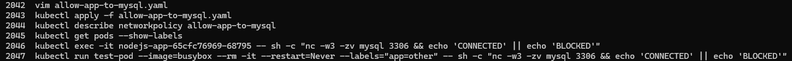
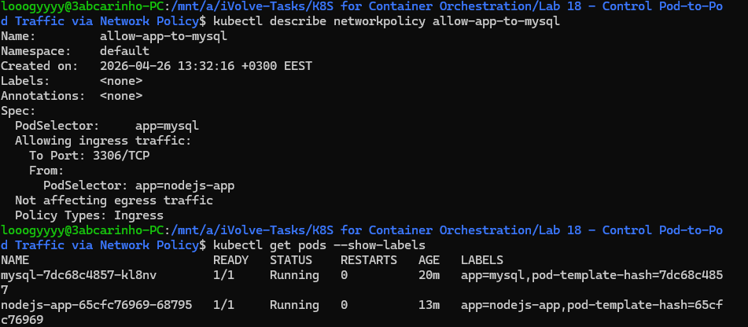
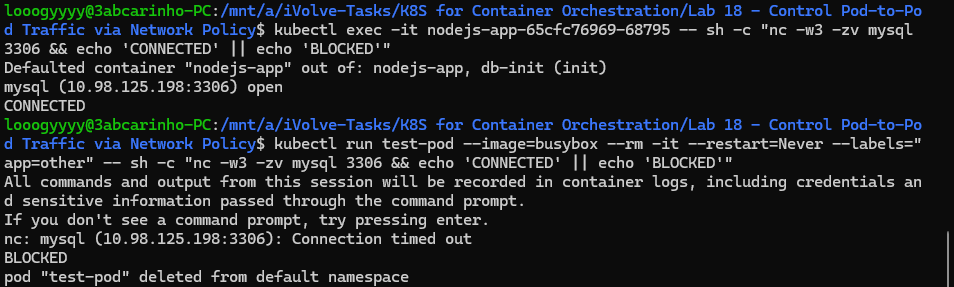

# Lab 18: Control Pod-to-Pod Traffic via Network Policy

## Overview
This lab demonstrates how to use Kubernetes NetworkPolicies to control pod-to-pod traffic. By default, all pods in a cluster can communicate freely. A NetworkPolicy was applied to restrict MySQL access so that only the Node.js application pods can reach it on port 3306, blocking all other pods from connecting.

## allow-app-to-mysql.yaml
```yaml
apiVersion: networking.k8s.io/v1
kind: NetworkPolicy
metadata:
  name: allow-app-to-mysql
  namespace: default
spec:
  podSelector:
    matchLabels:
      app: mysql
  policyTypes:
    - Ingress
  ingress:
    - from:
        - podSelector:
            matchLabels:
              app: nodejs-app
      ports:
        - protocol: TCP
          port: 3306
```

## Tools Used
- **kubectl** – Used to apply and describe the NetworkPolicy.
- **busybox / netcat (nc)** – Used to test connectivity from both allowed and blocked pods.

## Outcome
The NetworkPolicy was applied targeting pods with `app=mysql`, allowing ingress only from pods labeled `app=nodejs-app` on port 3306. Connectivity was tested from two pods — the Node.js app successfully connected (`CONNECTED`), while a test pod with label `app=other` timed out and was blocked (`BLOCKED`), confirming the policy was enforced correctly.

### Commands History


### NetworkPolicy Description & Pod Labels


### Connectivity Test — Connected vs Blocked
