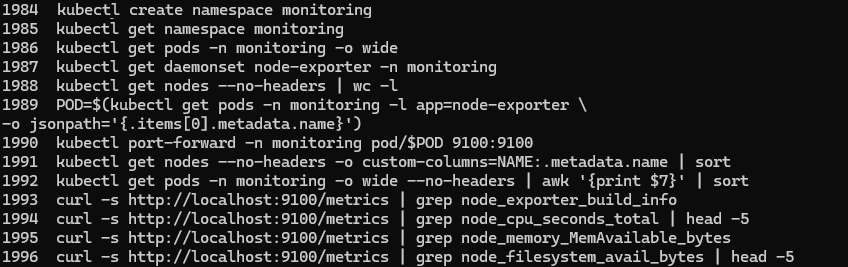
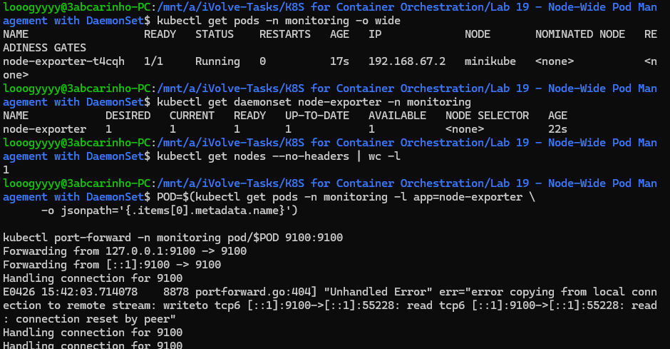
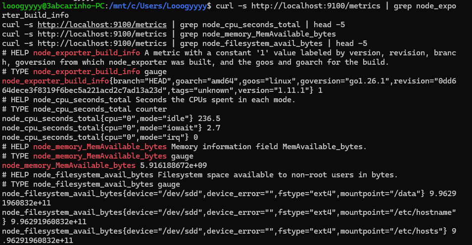
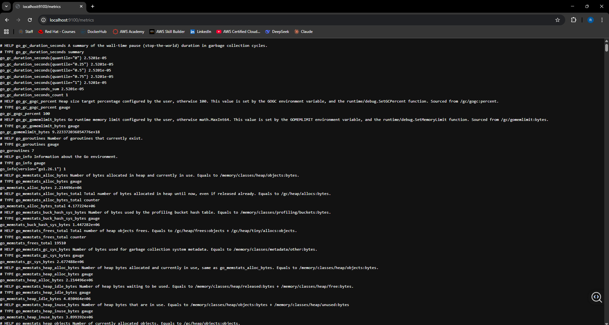

# Lab 19: Node-Wide Pod Management with DaemonSet

## Overview
This lab demonstrates how to use a Kubernetes DaemonSet to deploy a pod on every node in the cluster. The Prometheus Node Exporter was deployed as a DaemonSet in the `monitoring` namespace, collecting hardware and OS-level metrics from each node. A toleration with `operator: Exists` was added to ensure the pod schedules on all nodes regardless of any taints.

## node-exporter-ds.yaml
```yaml
apiVersion: apps/v1
kind: DaemonSet
metadata:
  name: node-exporter
  namespace: monitoring
  labels:
    app: node-exporter
spec:
  selector:
    matchLabels:
      app: node-exporter
  template:
    metadata:
      labels:
        app: node-exporter
    spec:
      tolerations:
        - operator: "Exists"
          effect: ""

      hostNetwork: true
      hostPID: true

      containers:
        - name: node-exporter
          image: prom/node-exporter:latest
          args:
            - "--path.sysfs=/host/sys"
            - "--path.rootfs=/host/root"
            - "--no-collector.wifi"
            - "--no-collector.hwmon"
            - "--collector.filesystem.mount-points-exclude=^/(dev|proc|sys|run|var/lib/docker/.+)($|/)"
          ports:
            - containerPort: 9100
              protocol: TCP
              name: metrics
          resources:
            requests:
              cpu: 100m
              memory: 30Mi
            limits:
              cpu: 250m
              memory: 180Mi
          volumeMounts:
            - name: sys
              mountPath: /host/sys
              mountPropagation: HostToContainer
              readOnly: true
            - name: root
              mountPath: /host/root
              mountPropagation: HostToContainer
              readOnly: true

      volumes:
        - name: sys
          hostPath:
            path: /sys
        - name: root
          hostPath:
            path: /
```

## Tools Used
- **kubectl** – Used to create the namespace, apply the DaemonSet, and verify pod scheduling.
- **Prometheus Node Exporter** – Collects node-level metrics and exposes them at `:9100/metrics`.
- **kubectl port-forward** – Used to access the metrics endpoint locally.
- **curl + grep** – Used to filter and verify specific metrics such as CPU, memory, and filesystem.

## Outcome
The DaemonSet was deployed in the `monitoring` namespace with a toleration that matches all taints, ensuring the node-exporter pod runs on every node. Metrics were successfully accessed at `localhost:9100/metrics` via port-forwarding. Specific metrics including `node_cpu_seconds_total`, `node_memory_MemAvailable_bytes`, and `node_filesystem_avail_bytes` were verified by grepping the metrics endpoint.

### Commands History


### DaemonSet & Pod Verification


### Metrics Grep Verification


### Metrics at :9100/metrics
