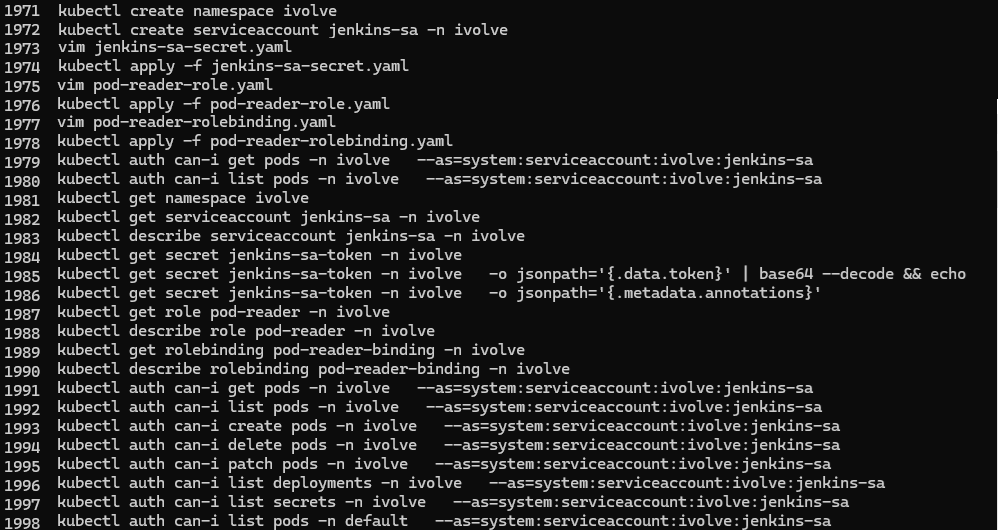
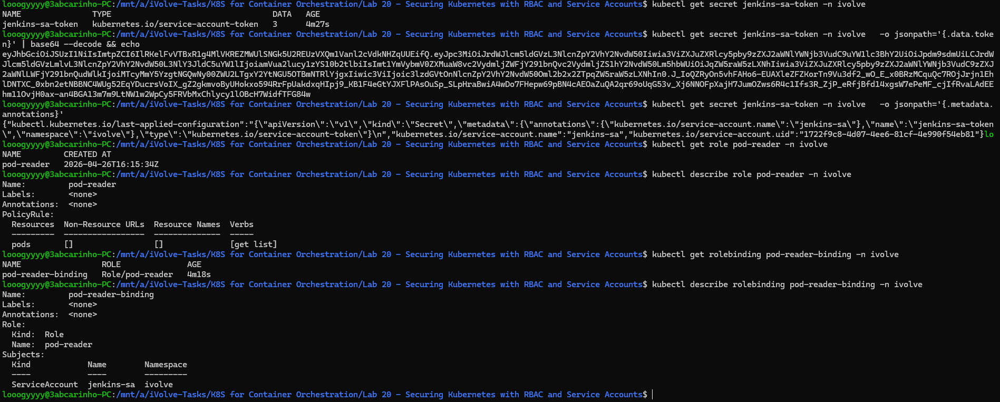
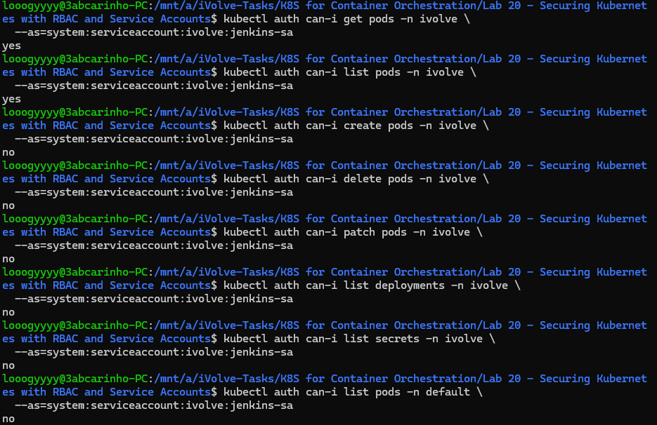

# Lab 20: Securing Kubernetes with RBAC and Service Accounts

## Overview
This lab demonstrates how to use Kubernetes RBAC (Role-Based Access Control) to restrict what a ServiceAccount can do within a namespace. A ServiceAccount was created for Jenkins, granted read-only access to pods via a Role and RoleBinding, and validated to confirm it cannot perform any actions beyond what was explicitly allowed.

## jenkins-sa-secret.yaml
```yaml
apiVersion: v1
kind: Secret
metadata:
  name: jenkins-sa-token
  namespace: ivolve
  annotations:
    kubernetes.io/service-account.name: jenkins-sa
type: kubernetes.io/service-account-token
```

## pod-reader-role.yaml
```yaml
apiVersion: rbac.authorization.k8s.io/v1
kind: Role
metadata:
  name: pod-reader
  namespace: ivolve
rules:
- apiGroups: [""]
  resources: ["pods"]
  verbs: ["get", "list"]
```

## pod-reader-rolebinding.yaml
```yaml
apiVersion: rbac.authorization.k8s.io/v1
kind: RoleBinding
metadata:
  name: pod-reader-binding
  namespace: ivolve
subjects:
- kind: ServiceAccount
  name: jenkins-sa
  namespace: ivolve
roleRef:
  kind: Role
  name: pod-reader
  apiGroup: rbac.authorization.k8s.io
```

## Tools Used
- **kubectl** – Used to create the ServiceAccount, apply RBAC resources, and validate permissions.
- **kubectl auth can-i** – Used to verify what actions the ServiceAccount is and isn't allowed to perform.

## Outcome
The `jenkins-sa` ServiceAccount was created in the `ivolve` namespace and a token was retrieved from its associated Secret. The `pod-reader` Role was bound to the ServiceAccount via a RoleBinding. Permission validation confirmed that `jenkins-sa` can `get` and `list` pods in the `ivolve` namespace, but is denied from creating, deleting, or patching pods, listing deployments or secrets, and accessing any resources in other namespaces.

### Commands History


### Token, Role & RoleBinding Verification


### Permission Validation
